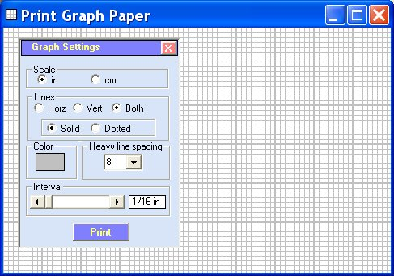



## Print Graph Sheets

### Description

Print Graph Sheets by Robert Rayment. Prints British(US) or Metric scales see screenshot for variations. Zip 8KB.
 
### More Info
 
Jusr run - needs a printer

Graph sheets

             |
---                |---
**Submitted On**   |2004-11-23 09:43:24
**By**             |[Robert Rayment](https://github.com/Planet-Source-Code/PSCIndex/blob/master/ByAuthor/robert-rayment.md)
**Level**          |Beginner
**User Rating**    |5.0 (40 globes from 8 users)
**Compatibility**  |VB 6\.0
**Category**       |[Complete Applications](https://github.com/Planet-Source-Code/PSCIndex/blob/master/ByCategory/complete-applications__1-27.md)
**World**          |[Visual Basic](https://github.com/Planet-Source-Code/PSCIndex/blob/master/ByWorld/visual-basic.md)
**Archive File**   |[Print\_Grap18217711252004\.zip](https://github.com/Planet-Source-Code/robert-rayment-print-graph-sheets__1-57412/archive/master.zip)

### API Declarations

None apart from Color & Print Dialogs

